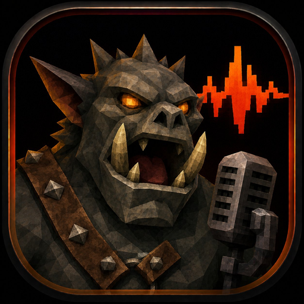

<p align="center">
  
</p>

<h1 align="center">grunt</h1>

<p align="center">
  <strong>Type text, get usable game VO.</strong> No studio, no microphone,
  no voice actor, no licensing risk — just legally-yours, game-ready voice
  clips in compressed Vorbis OGG, ready to drop into Godot.
</p>

grunt exists to remove a barrier most solo and small-team devs hit: a game
needs hundreds of barks, grunts, reactions, and effort sounds, but you have no
booth, no mic, no VO budget, and no rights-cleared way to fill them. The usual
outcomes are shipping silence, misusing a sample pack, or burning a tiny budget
on a handful of lines. grunt gives you a fourth option — type the line, get a
clip that's stylized, characterful, and **yours to ship**.

**The philosophy:** game audio has overindexed on realism. But players don't
experience realism — they experience legibility and feel. Animal Crossing's
gibberish, Undertale's blips, the original creature grunts of early 3D games:
none of it is realistic, and all of it is more memorable than most photoreal
VO. The blank a game actually needs filled isn't "a human said this line" — it's
"the player understood the enemy is angry and there's something over there."
grunt fills *that* blank. Reserve real voice acting for the key story moments;
let grunt handle the everything-else.

It does this two ways: **generate** banks from a license-cleared open TTS model
(no recording at all — the main path), or stitch your own recorded units. Either
way, output runs through a PS1-style FX chain that turns "slightly synthetic"
into "intentionally retro," and a ship gate guarantees nothing un-owned can ever
leave the building. No cloud, no runtime synthesis — grunt bakes files at rest
that import into Godot like any other audio asset.

See `vocalizer_tdd.md` (the design doc) for the full architecture, and
`ROADMAP.md` for progress and the principle that guides it.

## Build

Requires a C++20 compiler. OGG/Vorbis output (the default) needs
**libvorbis + libvorbisenc + libogg**. With CMake:

```
cmake -S . -B build -DCMAKE_BUILD_TYPE=Release
cmake --build build
ctest --test-dir build        # run unit tests
```

CMake auto-detects libvorbis. If it's missing, grunt still builds but emits
**WAV only** (and says so). To get OGG output:

- Windows: `vcpkg install libvorbis libogg`, then configure with the vcpkg toolchain.
- Debian/Ubuntu: `sudo apt install libvorbis-dev libogg-dev`.
- macOS: `brew install libvorbis libogg`.

Direct build without CMake (WAV-only, no OGG):

```
g++ -std=c++20 -O2 -Iinclude src/*.cpp -o grunt
```

With OGG, add `-DGRUNT_HAVE_VORBIS` and link `-lvorbisenc -lvorbis -logg`.

## Commands

```
grunt verify   --voice voices/heavy_brother
grunt phonemes --text "Open the gate!"
grunt synth    --text "Open the gate!" --voice voices/heavy_brother \
               --emotion urgent --style clean_ps1 --seed 42 --out open_gate.ogg
grunt batch    --csv scripts/sample_lines.csv --voice voices/heavy_brother \
               --out-dir build/vo --seed 1234
```

- `--emotion` : `neutral | urgent | angry`
- `--style`   : `clean_ps1 | radio_ps1 | monster_ps1 | robot_ps1 | muffled_mask`
- `--format`  : `ogg | wav`. **Default: ogg (Vorbis).** The output extension is
  forced to match the format. WAV is for debugging / no-libvorbis builds.
- `--quality` : libvorbis VBR quality, `-0.1`..`1.0` (default `0.4`).
- `--seed`    : fixed seed -> byte-identical output (reproducible asset builds).
  Omit for slight per-render variation.

Note: OGG here means the OGG **container with a Vorbis stream** — the codec
Godot's `AudioStreamOggVorbis` decodes. Not Opus.

## Output: a sound bank gool imports by name

`batch` produces a folder of named clips plus a `bank.json` manifest:

```
build/vo/
  mission01_open_gate.ogg
  goblin_taunt_01.ogg
  ...
  bank.json
```

The **clip name is the contract**. The game references clips by name through
gool (`Gool.has_sound("goblin_taunt_01")` then `create_emitter`). grunt's job
ends at producing named files; which event triggers which clip — and where in
3D space — is gool/Godot wiring. `bank.json` carries build-time metadata
(text, emotion, seed, peak) the runtime doesn't need.

## How this fits your game (no build-time coupling)

grunt is a standalone authoring tool. It is **not** wired into your game's
build. You run it whenever you want; it writes `.ogg` files that sit at rest;
you drop them into your Godot project's `res://` folder and they import like
any other audio asset. "Pre-build" in the design doc just means the clips are
baked ahead of time rather than synthesized during gameplay — there is no
runtime synthesis and nothing to integrate into your game's compile.

- One clip by hand:
  `grunt synth --text "Open the gate!" --out open_gate.ogg` -> copy into Godot.
- A whole bank from a script: `grunt batch ...` (see above).

## GUI: type, hear it, export

`grunt_gui` is a small desktop window: type a line, pick voice / emotion /
style, hit **Play** to hear it (nothing written to disk), then **Export** to
save a clip. It uses the same Engine as the CLI, so a preview sounds identical
to what you'll bake.

It's an optional target (extra dependencies), off by default. Vendor Dear ImGui
+ miniaudio and install GLFW per `third_party/README.md`, then:

```
cmake -S . -B build -DGRUNT_BUILD_GUI=ON
cmake --build build
./build/grunt_gui
```

The GUI deps are GUI-only and permissively licensed — they never touch the CLI
or the baked clips.

## Generating voice banks with CC0 / open generators (no recording)

For the "everything else" bark/effort/reaction layer, grunt can build voice
banks from a license-cleared open TTS generator instead of recordings — so you
reserve real VO for key story lines only.

```
grunt generate --units units.csv --voice voices/orc --model <cleared-model-id>
```

`units.csv` rows are `key,text` (e.g. `ge,gah`). grunt synthesizes each unit,
writes it into the bank, and stamps each clip's provenance from the model's
license. grunt then concatenates these units like any other bank.

**Why this is legally airtight, by construction:**

- grunt only generates from models listed in `data/voice_models.json` — a
  registry where each entry is license diligence done *once* (CC0 / Apache,
  commercial + redistributable confirmed). Diligence becomes data, then the
  gate enforces it forever.
- The generator binary (Piper, etc.) is a **build-time tool** — grunt shells
  out to it and never links it. Only the rendered audio ships, and that audio's
  rights come from the model's license.
- The **ship gate** refuses to bake any clip whose model isn't
  commercial+redistributable. A CC0-model clip passes; a non-commercial or
  unverified one is blocked before it can reach a shipped bank.

**Recommended generator: Piper** (MIT engine) with a **CC0 voice model** —
runs offline on CPU, and its slightly-synthetic output is masked by grunt's
PS1 FX chain. The included `--generator stub` produces deterministic test tones
that are *always* gate-blocked (marked synth-derived), so you can exercise the
whole pipeline offline without installing Piper.

> Not legal advice. Voice-model licenses vary — including transitively through
> training data. Confirm each model (and its dataset) before adding it to the
> registry; the gate then keeps you honest.

## The ship gate (clean licensing, enforced)

Every clip carries a `provenance` block in `units.json`. `verify` — and
`batch`, which runs it first — refuses to ship a bank if any clip is:

- `synth_tool_derived: true` (eSpeak/MBROLA placeholder), or
- `commercial_use: false`, or
- a `sample_pack` without a recognized commercial/redistributable license.

Prototype freely with placeholder clips; the gate guarantees they can never
reach a baked bank. This makes "no third-party licensing exposure" an
invariant the tool enforces, not a hope.

## Voice bank layout

```
voices/heavy_brother/
  voice.json                 # manifest (id, sample rate, base pitch, style)
  units/
    grunts/  syllables/  words/
  metadata/
    units.json               # per-clip metadata + provenance
```

The included `heavy_brother` bank uses **synthetic placeholder tones** so the
pipeline is runnable out of the box — replace them with real recordings (and
keep `synth_tool_derived: false` only when they are genuinely owned).

## Status / next

Phase 0 is complete and tested: normalizer, grunt-mode syllable planner,
data-driven prosody, unit selection with repetition penalty, concatenative
renderer (zero-crossing align + crossfade + pitch/time + limiter), PS1 FX
presets, batch bank bake, deterministic seeds, and the provenance ship gate.

Next per the TDD: Phase 1 (real CMUdict phoneme mapper + unknown-word
fallback), Phase 2 (syllable DB + coverage reporting), Phase 3 (diphones +
Viterbi unit selection).

See `ROADMAP.md` for full progress tracked against the TDD phases and
acceptance criteria.
